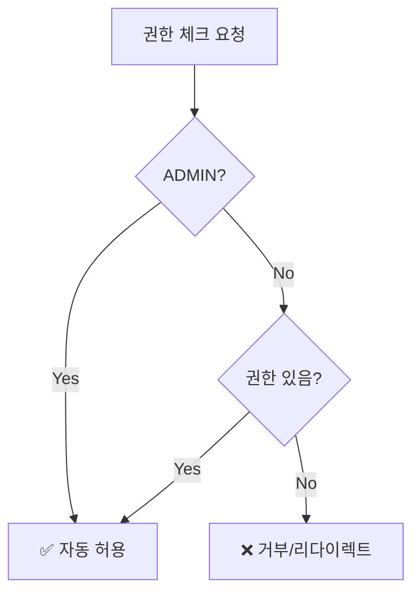

# ADMIN 권한 우회 시스템

**날짜**: 2025-10-10  
**목적**: ADMIN은 모든 권한 체크를 우회하고 자동으로 접근 허용

---

## 🎯 핵심 개념

**ADMIN 역할은 시스템의 슈퍼유저로, 모든 권한 체크를 우회합니다.**

### Before ❌

```typescript
// ADMIN도 일일이 권한을 체크
if (hasPermission(permissions, 'salary.management', 'read')) {
  // 접근 허용
}
// ADMIN이 해당 권한이 없으면 접근 불가
```

### After ✅

```typescript
// ADMIN은 자동으로 모든 권한 허용
if (isAdmin || hasPermission(permissions, 'salary.management', 'read')) {
  // 접근 허용
}
// ADMIN은 권한 체크 없이 항상 접근 가능
```

---

## 📝 변경 사항

### 1. 클라이언트 사이드: `src/lib/stores/permissions.ts`

```typescript
export const can: Readable<{...}> = derived(userPermissions, ($userPermissions) => {
  const permissions = $userPermissions?.permissions || []
  const roles = $userPermissions?.roles || []
  const isAdmin = hasRole(roles, RoleCode.ADMIN)

  return {
    // ADMIN은 모든 권한 체크 우회
    read: (resource: string, scope?: 'own' | 'department' | 'all') =>
      isAdmin || hasPermission(permissions, resource, PermissionAction.READ, scope),

    write: (resource: string, scope?: 'own' | 'department' | 'all') =>
      isAdmin || hasPermission(permissions, resource, PermissionAction.WRITE, scope),

    delete: (resource: string, scope?: 'own' | 'department' | 'all') =>
      isAdmin || hasPermission(permissions, resource, PermissionAction.DELETE, scope),

    approve: (resource: string, scope?: 'own' | 'department' | 'all') =>
      isAdmin || hasPermission(permissions, resource, PermissionAction.APPROVE, scope),

    hasAnyRole: (roleCodes: RoleCode[]) =>
      isAdmin || roleCodes.some((code) => hasRole(roles, code)),

    isAdmin: () => isAdmin,
  }
})
```

**효과**:

- `$can.read()`, `$can.write()` 등 모든 함수가 ADMIN일 경우 자동으로 `true` 반환
- 사이드바 메뉴, PermissionGate 등 모든 클라이언트 권한 체크에 적용

### 2. 서버 사이드: `src/lib/server/auth/permission-guard.ts` (신규)

재사용 가능한 헬퍼 함수들:

#### `isAdmin(permissions)`

```typescript
// ADMIN 역할 확인
if (isAdmin(permissions)) {
  // 모든 권한 허용
}
```

#### `hasPermission(permissions, resource, action)`

```typescript
// ADMIN은 자동 true, 나머지는 실제 권한 체크
const canRead = hasPermission(permissions, 'salary.management', 'read')
```

#### `requirePermission(permissions, resource, action)`

```typescript
// ADMIN은 통과, 권한 없으면 리다이렉트
export const load: ServerLoad = async ({ locals }) => {
  requirePermission(locals.permissions, 'salary.management', 'read')
  return {}
}
```

#### `requireAnyPermission(permissions, resources)`

```typescript
// 여러 권한 중 하나라도 있으면 통과, ADMIN은 자동 통과
requireAnyPermission(permissions, [
  { resource: 'finance.accounts', action: 'read' },
  { resource: 'finance.transactions', action: 'read' },
])
```

#### `requireRole(permissions, roleCodes)`

```typescript
// 특정 역할 필요, ADMIN은 자동 통과
requireRole(permissions, ['FINANCE_MANAGER', 'MANAGEMENT'])
```

### 3. 페이지 서버 로드 리팩토링

#### Before (복잡함) ❌

```typescript
// src/routes/salary/+page.server.ts
export const load: ServerLoad = async ({ locals }) => {
  const permissions = locals.permissions

  if (!permissions) {
    throw redirect(302, '/login')
  }

  const isAdmin = permissions.roles.some((role) => role.code === 'ADMIN')
  if (isAdmin) {
    return {}
  }

  const hasPermission = permissions.permissions.some(
    (p) => p.resource === 'salary.management' && p.action === 'read',
  )

  if (!hasPermission) {
    throw redirect(302, '/unauthorized')
  }

  return {}
}
```

#### After (간결함) ✅

```typescript
// src/routes/salary/+page.server.ts
import { requirePermission } from '$lib/server/auth/permission-guard'

export const load: ServerLoad = async ({ locals }) => {
  requirePermission(locals.permissions, 'salary.management', 'read')
  return {}
}
```

---

## 🔒 권한 체크 흐름



---

## 📍 적용 위치

### 클라이언트 사이드

- ✅ `$can.read()`, `$can.write()`, `$can.delete()`, `$can.approve()`
- ✅ `$can.hasAnyRole()`
- ✅ Sidebar 메뉴 표시/숨김
- ✅ PermissionGate 컴포넌트
- ✅ 버튼 활성화/비활성화

### 서버 사이드

- ✅ `requirePermission()` - 간단한 권한 체크
- ✅ `requireAnyPermission()` - 복수 권한 체크
- ✅ `requireRole()` - 역할 체크
- ✅ `hasPermission()` - 조건부 권한 체크
- ✅ `isAdmin()` - ADMIN 여부 확인

---

## 🧪 테스트 시나리오

### ADMIN 사용자

```
[ ] 모든 사이드바 메뉴 표시
[ ] Planner 접근 가능
[ ] 급여관리 접근 가능
[ ] 프로젝트 관리 접근 가능
[ ] 권한 매트릭스 접근 가능
[ ] 모든 CRUD 작업 가능
```

### RESEARCHER 사용자

```
[ ] Planner 메뉴 표시 및 접근 가능
[ ] 급여관리 메뉴 숨김
[ ] 프로젝트 관리 메뉴 숨김
[ ] /salary 직접 접속 → /unauthorized
[ ] /project-management 직접 접속 → /unauthorized
[ ] Planner에서 모든 CRUD 작업 가능
```

### EMPLOYEE 사용자

```
[ ] 대시보드 접근 가능
[ ] 본인 HR 정보 조회 가능
[ ] 본인 급여명세서 조회 가능
[ ] 관리 메뉴 모두 숨김
```

---

## 💡 사용 예시

### 1. 페이지 접근 제어

```typescript
// src/routes/finance/+page.server.ts
import { requirePermission } from '$lib/server/auth/permission-guard'

export const load: ServerLoad = async ({ locals }) => {
  requirePermission(locals.permissions, 'finance.accounts', 'read')
  return {}
}
```

### 2. 조건부 데이터 필터링

```typescript
// src/routes/dashboard/+page.server.ts
import { hasPermission, isAdmin } from '$lib/server/auth/permission-guard'

export const load: ServerLoad = async ({ locals }) => {
  const permissions = locals.permissions

  // ADMIN은 모든 데이터, 나머지는 본인 데이터만
  if (isAdmin(permissions)) {
    return { data: await getAllData() }
  } else {
    return { data: await getMyData(locals.user.id) }
  }
}
```

### 3. 역할 기반 접근

```typescript
// src/routes/reports/+page.server.ts
import { requireRole } from '$lib/server/auth/permission-guard'

export const load: ServerLoad = async ({ locals }) => {
  // ADMIN, MANAGEMENT, RESEARCH_DIRECTOR만 접근 가능
  requireRole(locals.permissions, ['MANAGEMENT', 'RESEARCH_DIRECTOR'])
  return {}
}
```

### 4. 복수 권한 체크

```typescript
// src/routes/analytics/+page.server.ts
import { requireAnyPermission } from '$lib/server/auth/permission-guard'

export const load: ServerLoad = async ({ locals }) => {
  // 재무 또는 영업 권한 중 하나라도 있으면 접근 가능
  requireAnyPermission(locals.permissions, [
    { resource: 'finance.accounts', action: 'read' },
    { resource: 'sales.customers', action: 'read' },
  ])
  return {}
}
```

---

## 🎯 핵심 원칙

1. **ADMIN은 권한 체크를 우회**
   - DB에 권한이 있든 없든 상관없이 모든 접근 허용
2. **일반 사용자는 명시적 권한 필요**
   - DB의 `employee_roles` → `role_permissions` → `permissions` 체인 확인
3. **보안 레이어는 4중 방어**
   - Sidebar (메뉴 숨김)
   - PermissionGate (컴포넌트 숨김)
   - +page.server.ts (서버 리다이렉트)
   - hooks.server.ts (미들웨어)

4. **코드 재사용성**
   - `permission-guard.ts` 헬퍼 함수 사용
   - 중복 코드 제거
   - 일관된 권한 체크 로직

---

## ✅ 완료 체크리스트

- [x] `permissions.ts` - ADMIN 우회 로직 추가
- [x] `permission-guard.ts` - 서버 헬퍼 함수 생성
- [x] `salary/+page.server.ts` - 헬퍼 함수 적용
- [x] `project-management/+page.server.ts` - 헬퍼 함수 적용
- [ ] 서버 재시작
- [ ] ADMIN 로그인 테스트
- [ ] RESEARCHER 로그인 테스트
- [ ] 권한별 페이지 접근 테스트

---

**다음 단계**: 서버 재시작 후 ADMIN으로 로그인하여 모든 메뉴 접근 가능한지 확인 🚀
