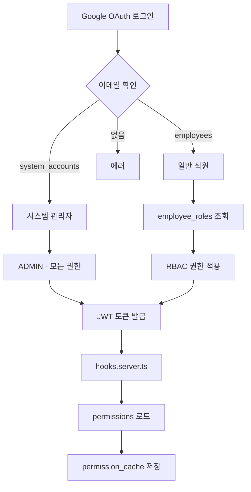

# 시스템 정리 완료 - 최종 요약

**날짜**: 2025-10-10  
**작업**: users 테이블 제거 및 RBAC 시스템 정리

---

## ✅ 완료된 작업

### 1. Migration 012: ADMIN 전체 권한 할당

```
✅ ADMIN: 56/56 권한 보유
✅ RESEARCHER: 21/56 권한 보유 (planner 포함)
```

### 2. Migration 013: users 테이블 제거

```
✅ users 테이블 삭제
✅ user_sessions 테이블 삭제
✅ audit_logs 테이블 삭제
✅ 관련 트리거/함수 삭제
```

### 3. Migration 014: RBAC 스키마 정리

```
✅ user_roles 테이블 삭제 (→ employee_roles 사용)
✅ role_permissions.granted_by 제거 (→ granted_by_employee_id 사용)
```

### 4. 코드 정리

```
✅ src/lib/database/connection.ts - users 관련 함수 제거
✅ DatabaseUser import 제거
```

---

## 📊 최종 시스템 구조

### 인증 시스템 (2-Tier)

```
system_accounts (1개)
  └─ 시스템 관리자
  └─ ADMIN 역할 고정
  └─ 모든 권한 보유

employees (39개)
  └─ 일반 직원
  └─ employee_roles로 역할 매핑
  └─ RBAC 권한 시스템 적용
```

### RBAC 시스템

```
roles (9개)
  ├─ ADMIN
  ├─ MANAGEMENT
  ├─ FINANCE_MANAGER
  ├─ HR_MANAGER
  ├─ ADMINISTRATOR
  ├─ RESEARCH_DIRECTOR
  ├─ SALES
  ├─ RESEARCHER
  └─ EMPLOYEE

permissions (56개)
  ├─ common.* (공통)
  ├─ finance.* (재무)
  ├─ hr.* (인사)
  ├─ salary.management.* (급여 관리)
  ├─ project.* (프로젝트)
  ├─ planner.* (플래너 - 15개)
  └─ sales.* (영업)

role_permissions (155개)
  └─ 역할별 권한 매핑

employee_roles (15개)
  └─ 직원별 역할 매핑

permission_cache (0개 - 방금 초기화됨)
  └─ 로그인 시 자동 생성
```

---

## 🔐 인증 흐름



---

## 🎯 주요 버그 수정

### Bug #1: 잘못된 사용자 ID

```typescript
// Before ❌
const permissions = await permissionService.getUserPermissions(user.id)

// After ✅
const permissions = await permissionService.getUserPermissions(employee.id)
```

### Bug #2: 권한 혼동

```typescript
// Before ❌
Resource.HR_PAYSLIPS // 급여 시스템 전체

// After ✅
Resource.SALARY_MANAGEMENT // 급여 관리 시스템
Resource.HR_PAYSLIPS // 본인 급여명세서만
```

### Bug #3: 트리거 오류

```sql
-- Before ❌
DELETE FROM permission_cache WHERE employee_id IN (
  SELECT user_id FROM user_roles ...
)

-- After ✅
DELETE FROM permission_cache WHERE employee_id IN (
  SELECT employee_id FROM employee_roles ...
)
```

### Bug #4: 불필요한 테이블

```
Before ❌: users, user_sessions, audit_logs, user_roles
After ✅: 모두 제거, employees + employee_roles 사용
```

---

## 📝 다음 할 일

### 1. 서버 재시작 (필수)

```bash
# 현재 터미널에서 서버 중지 (Ctrl+C)
npm run dev
```

### 2. 재로그인

- 브라우저에서 로그아웃
- 다시 로그인 (권한 새로 로드)

### 3. 테스트 체크리스트

```
[ ] Google OAuth 로그인 정상 작동
[ ] ADMIN 로그인
    [ ] 모든 사이드바 메뉴 표시
    [ ] Planner 메뉴 보임
    [ ] 급여관리 접근 가능
    [ ] 프로젝트 관리 접근 가능

[ ] RESEARCHER 로그인
    [ ] Planner 메뉴 보임
    [ ] Planner 페이지 접근 가능
    [ ] 급여관리 메뉴 숨김
    [ ] 프로젝트 관리 메뉴 숨김
    [ ] /salary 접근 시 /unauthorized 리다이렉트
    [ ] /project-management 접근 시 /unauthorized 리다이렉트
```

---

## 📁 생성된 파일

### Migrations

- `migrations/012_grant_all_permissions_to_admin.sql`
- `migrations/013_remove_users_table.sql`
- `migrations/014_cleanup_rbac_schema.sql`

### 문서

- `migrations/012_ADMIN_PERMISSIONS.md` (필요시 생성)
- `migrations/013_USERS_TABLE_REMOVAL.md`

### 스크립트

- `scripts/verify-cleanup.sql`
- `scripts/clear-permission-cache.sql`
- `scripts/compare-permissions.sql`

---

## 🎉 기대 효과

1. **단순성**: 명확한 2-tier 인증 시스템
2. **성능**: 불필요한 조인 제거
3. **유지보수**: 단일 소스 (employees)
4. **명확성**: 인증과 권한의 분리
5. **보안**: 4중 방어 시스템
   - 사이드바 권한 체크
   - 서버사이드 권한 체크 (+page.server.ts)
   - PermissionGate (클라이언트)
   - hooks.server.ts (서버 미들웨어)

---

## 🔍 디버깅 팁

### 권한이 제대로 로드되지 않는 경우

1. **서버 로그 확인**:

```typescript
// hooks.server.ts에서 출력됨
console.log('👤 User:', user.email)
console.log('👥 Employee:', employee.id)
console.log('🎫 Permissions loaded:', permissions.permissions.length)
```

2. **브라우저 콘솔 확인**:

```javascript
// DevTools Console에서
console.log('Permissions:', $userPermissions)
```

3. **DB에서 직접 확인**:

```sql
-- 특정 직원의 권한 확인
SELECT p.code
FROM employee_roles er
JOIN role_permissions rp ON er.role_id = rp.role_id
JOIN permissions p ON rp.permission_id = p.id
WHERE er.employee_id = 'EMPLOYEE_UUID';
```

4. **캐시 초기화**:

```sql
DELETE FROM permission_cache WHERE employee_id = 'EMPLOYEE_UUID';
```

---

## ✅ 검증 완료

```
✅ users 테이블 제거됨
✅ RBAC 시스템 정리됨
✅ ADMIN 56개 권한 보유
✅ RESEARCHER 21개 권한 보유 (planner 포함)
✅ permission_cache 초기화됨
✅ 코드 정리 완료
```

**다음 단계: 서버 재시작 → 재로그인 → 테스트** 🚀
